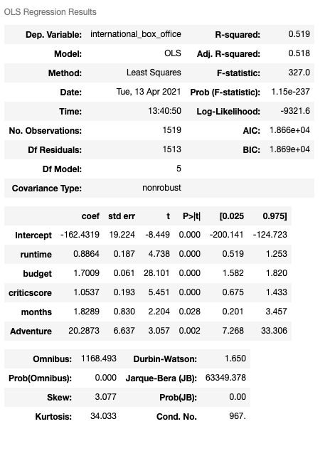
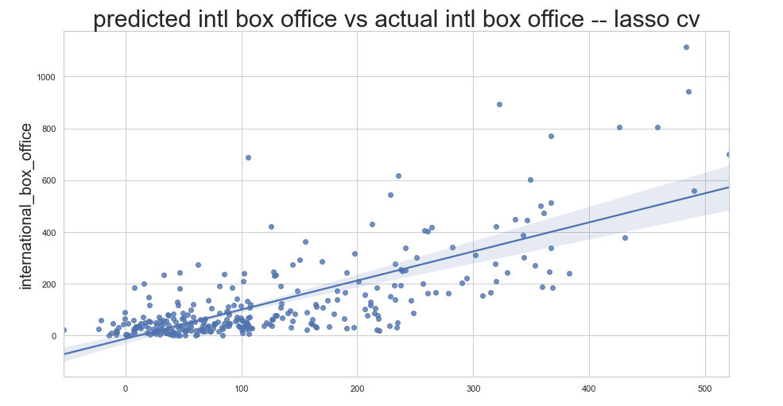

#Regression MVP

The goal of my regression project is to see if I can predict the international box office gross of films using pre-release features only. 

My baseline model currently consists of 5 features with a R-Squared score of 0.519, P-values of less than 0.02, and no multicollinearity. My RMSE is currently 111 million, which could use some improvement. 

After running my model through a Lasso linear model with cross validation of 5 folds, my R-Squared score improved to 0.543. While this is a good indication of the direction I should head into with my model, I need to circle back and cross validate my model and retrieve the R-Squared, RMSE, and MAE score for the train and validate data sets in order to gain a better understanding of how to improve my model's predictability. 

